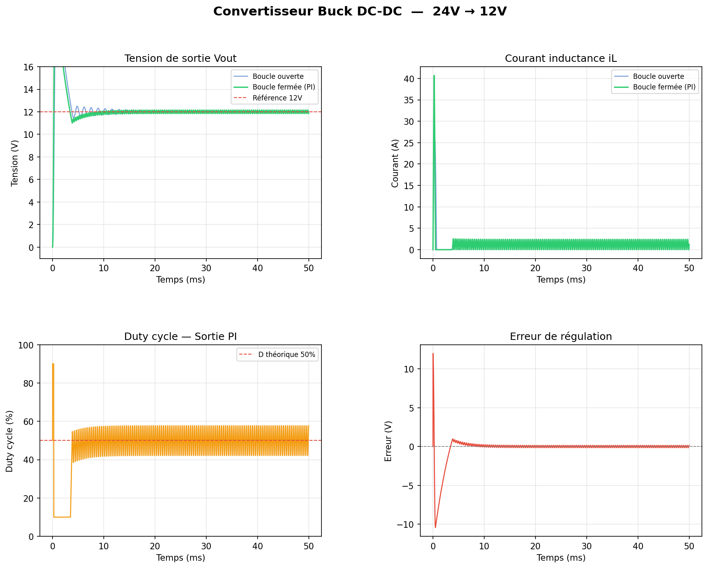

# buck-converter
Advanced Buck DC-DC converter simulation: 24V→12V, PWM control, closed-loop PI regulation, Bode analysis and professional plots. Built with Python (NumPy, SciPy, Matplotlib).

# Buck Converter DC-DC — 24V → 12V


> Simulation complète d'un convertisseur Buck DC-DC avancé :
> contrôle PWM, régulation PI en boucle fermée, analyse de Bode
> et visualisation professionnelle des résultats.

---

## Aperçu des résultats




---

## Caractéristiques

| Paramètre | Valeur |
|---|---|
| Tension d'entrée Vin | 24V |
| Tension de sortie Vout | 12V |
| Fréquence de découpage | 50 kHz |
| Inductance L | 100 µH |
| Condensateur C | 470 µF |
| Résistance de charge R | 10 Ω |
| Rapport cyclique D | 50% |
| Temps de réponse PI | ~10 ms |
| Ripple tension | < 0.4V |

---

## Théorie — Convertisseur Buck

### Principe de base

Un convertisseur Buck abaisse la tension continue par découpage
à haute fréquence. Le rapport cyclique D contrôle la tension de sortie :

$$V_{out} = D \times V_{in}$$

Pour 24V → 12V :

$$D = \frac{V_{out}}{V_{in}} = \frac{12}{24} = 0.5$$

### Équations d'état du circuit LC

$$\frac{di_L}{dt} = \frac{V_{in} \cdot D - V_{out}}{L}$$

$$\frac{dV_{out}}{dt} = \frac{i_L - \frac{V_{out}}{R}}{C}$$

### Fréquence de résonance

$$f_{res} = \frac{1}{2\pi\sqrt{LC}}$$

### Ondulation tension et courant

$$\Delta V_{out} = \frac{V_{out}(1-D)}{8 \cdot L \cdot C \cdot f_{sw}^2}$$

$$\Delta i_L = \frac{(V_{in} - V_{out}) \cdot D}{L \cdot f_{sw}}$$

### Régulateur PI

$$u(t) = K_p \cdot e(t) + K_i \int e(t) \, dt$$

Avec :
- $K_p = 0.8$ — gain proportionnel
- $K_i = 200$ — gain intégral
- Anti-windup activé

---

## Structure du projet
buck-converter/
├── src/
│   ├── buck_model.py       # Modèle circuit Buck
│   ├── pwm.py              # Générateur PWM
│   ├── pi_controller.py    # Régulateur PI + anti-windup
│   └── utils.py            # Fonctions utilitaires
├── simulation/
│   ├── config.yaml         # Paramètres physiques
│   ├── run_sim.py          # Simulation principale
│   ├── open_loop.py        # Boucle ouverte
│   ├── closed_loop.py      # Boucle fermée PI
│   ├── bode_plot.py        # Diagramme de Bode
│   ├── efficiency_plot.py  # Courbes de rendement
│   └── run_all_plots.py    # Génération complète
├── tests/
│   ├── test_model.py       # Tests unitaires modèle
│   ├── test_pi.py          # Tests régulateur PI
│   └── test_pwm.py         # Tests PWM
├── assets/                 # Graphiques générés
├── docs/                   # Documentation détaillée
├── requirements.txt
└── README.md

---

## Installation

### Prérequis

- Python 3.9+
- pip

### Cloner le repo

```bash
git clone https://github.com/AMEZOUARm/buck-converter.git
cd buck-converter
```

### Installer les dépendances

```bash
pip install -r requirements.txt
```

---

## Utilisation

### Lancer toutes les simulations

```bash
python simulation/run_all_plots.py
```

### Simulation principale uniquement

```bash
python simulation/run_sim.py
```

### Diagramme de Bode uniquement

```bash
python simulation/bode_plot.py
```

### Modifier les paramètres

Éditez `simulation/config.yaml` :

```yaml
converter:
  vin: 24.0        # Tension entrée (V)
  vout: 12.0       # Tension cible (V)
  frequency: 50000 # Fréquence PWM (Hz)

pi_controller:
  kp: 0.8          # Gain proportionnel
  ki: 200.0        # Gain intégral
```

---

## Résultats

### Boucle ouverte vs boucle fermée

| Métrique | Boucle ouverte | Boucle fermée PI |
|---|---|---|
| Vout moyen | 12.00V | 11.99V |
| Ripple tension | 0.54V | 0.39V |
| Temps de réponse | — | 9.9ms |
| Rendement η | 50.1% | 50.0% |

### Analyse fréquentielle

- Fréquence de résonance : **~107 Hz**
- Marge de gain suffisante sur toute la plage 1Hz–100kHz

---

## Documentation

- [Théorie complète](docs/theory.md)
- [Formules et équations](docs/formulas.md)
- [Guide d'utilisation](docs/usage.md)
- [Référence API](docs/api_reference.md)

---

## Lancer les tests

```bash
pytest tests/ -v
```

---

## Auteur

**AMEZOUARm**
- GitHub : [@AMEZOUARm](https://github.com/AMEZOUARm)

---

## Licence

Ce projet est sous licence [MIT](LICENSE).
